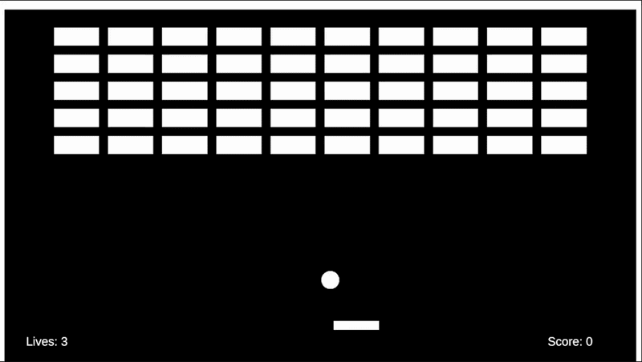

# Breakout

A recreation of the classic **Breakout** arcade game built with **Unity 6** and **C#** as part of my game development journey and the 20 Games Challenge.

## Features

- 🧱 Procedurally generated brick layout
- 🎾 Ball physics with dynamic paddle bounce
- 🎮 Smooth paddle movement
- 💯 Score tracking
- ❤️ Lives system
- 🔄 Ball respawning after losing a life
- ☠️ Game Over screen
- 📊 Final score display
- 🔁 Restart the game with the Space key

## Controls

| Action | Key |
|--------|-----|
| Move Left | A / Left Arrow |
| Move Right | D / Right Arrow |
| Restart (Game Over) | Space |

## Built With

- Unity 6
- C#
- TextMeshPro

## Screenshots

### Gameplay

### Game Over

## What I Learned

This project helped me practice:

- Game state management
- UI creation using Unity Canvas
- Prefabs and object instantiation
- Collision detection
- Basic game architecture
- Organizing scripts
- Working with TextMeshPro
- Git and GitHub workflow

## Future Improvements

- Sound effects
- Background music
- Particle effects
- Multiple levels
- Power-ups
- High score system
- Pause menu

## 20 Games Challenge

This project is the second game in my 20 Games Challenge.

- ✅ Pong
- ✅ Breakout
- ⏳ Space Invaders

---

Inspired by the original Breakout arcade game by Atari.
